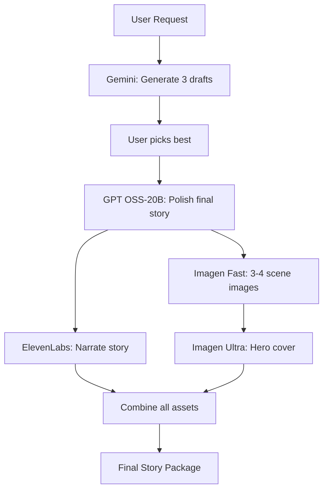

# Multi-Provider AI Strategy

## 🎯 Overview

Masal Fabrikası uses a **multi-provider AI strategy** for optimal cost/performance/quality balance:

```
┌─────────────────────────────────────────────┐
│         AI Provider Strategy                │
├─────────────────────────────────────────────┤
│ Draft/Brainstorm → Gemini Flash (cheap)    │
│ Final Story      → GPT OSS-20B (quality)   │
│ Embeddings       → text-embedding-3-small  │
│ STT              → Whisper Turkish         │
│ TTS              → ElevenLabs              │
│ Images (fast)    → Imagen v4 Fast          │
│ Images (hero)    → Imagen v4 Ultra         │
└─────────────────────────────────────────────┘
```

---

## 📝 Use Cases & Models

### 1. 💭 Draft & Brainstorm
**Model**: `gemini-3-flash`  
**Provider**: Google Gemini  
**Use Case**: 
- Quick story ideation
- Multiple variations
- Character name generation
- Theme suggestions

**Why**: Ultra cheap, very fast, good enough for drafts

**Config**:
```env
GEMINI_API_KEY=your-google-api-key
GEMINI_MODEL=gemini-3-flash
```

---

### 2. 📖 Final Story Generation
**Model**: `openai/gpt-oss-20b`  
**Provider**: Wiro AI  
**Use Case**:
- Final polished stories
- Bedtime stories
- Character dialogues
- Story refinement

**Why**: Best quality/price ratio, good Turkish support

**Config**:
```env
GPT_API_KEY=your-wiro-key
GPT_BASE_URL=https://api.wiro.ai/v1
GPT_MODEL=openai/gpt-oss-20b
```

---

### 3. 🔍 Semantic Search (Embeddings)
**Model**: `text-embedding-3-small`  
**Provider**: OpenAI  
**Use Case**:
- Story similarity search
- Semantic search
- Content recommendations

**Why**: Industry standard, very cheap

**Config**:
```env
EMBEDDING_API_KEY=your-openai-key
EMBEDDING_BASE_URL=https://api.openai.com/v1
EMBEDDING_MODEL=text-embedding-3-small
```

**Cost**: ~$0.00002 per 1K tokens (çok ucuz)

---

### 4. 🎤 Speech to Text (STT)
**Model**: `openai/whisper-large-v3-turbo-turkish`  
**Provider**: Wiro AI  
**Use Case**:
- Voice stories
- User voice input
- Story narration recording

**Why**: Turkish-optimized, fast, accurate

**Config**:
```env
STT_API_KEY=your-wiro-key
STT_BASE_URL=https://api.wiro.ai/v1
STT_MODEL=openai/whisper-large-v3-turbo-turkish
```

---

### 5. 🔊 Text to Speech (TTS)
**Provider**: ElevenLabs  
**Use Case**:
- Story narration
- Character voices
- Audiobook generation

**Why**: Best voice quality, multiple voices, emotional range

**Config**:
```env
ELEVENLABS_API_KEY=your-elevenlabs-key
```

---

### 6. 🎨 Image Generation

#### Fast Images (Bulk)
**Model**: `google/imagen-v4-fast`  
**Use Case**:
- Chapter illustrations
- Character portraits
- Scene images
- Quick visualizations

**Why**: Very fast, good quality, cheap

#### Hero Images (Premium)
**Model**: `google/imagen-v4-ultra`  
**Use Case**:
- Story covers
- Marketing materials
- Featured artwork
- Premium illustrations

**Why**: Highest quality, photorealistic

**Config**:
```env
IMAGEN_API_KEY=your-google-api-key
IMAGEN_FAST_MODEL=google/imagen-v4-fast
IMAGEN_ULTRA_MODEL=google/imagen-v4-ultra
```

---

## 💰 Cost Breakdown

| Service | Model | Cost (est.) | Use Case |
|---------|-------|-------------|----------|
| Draft | Gemini Flash | ₺0.1-0.3/story | Brainstorming |
| Final Story | GPT OSS-20B | ₺0.5-1/story | Production |
| Embeddings | text-embedding | $0.00002/1K | Search |
| STT | Whisper Turkish | ₺0.1-0.3/min | Voice input |
| TTS | ElevenLabs | $0.18/1K chars | Narration |
| Images (Fast) | Imagen Fast | ₺0.5/image | Bulk |
| Images (Ultra) | Imagen Ultra | ₺2-3/image | Hero |

**Monthly Estimate**: ₺1,000-2,000 (moderate usage)

---

## 🔄 Workflow Example

### Complete Story Creation Flow



**Steps**:
1. **Draft** (Gemini): 3 story variations → ₺0.3
2. **Final** (GPT): Polish chosen draft → ₺1
3. **Images** (Imagen):
   - 4 scene images (fast) → ₺2
   - 1 hero cover (ultra) → ₺3
4. **Audio** (ElevenLabs): Narrate → ₺1

**Total**: ~₺7.3 per complete package

---

## ⚙️ Configuration

### Minimal Setup (Stories Only)
```env
GEMINI_API_KEY=...      # Drafts
GPT_API_KEY=...         # Final stories
```

### Full Setup (All Features)
```env
GEMINI_API_KEY=...      # Drafts
GPT_API_KEY=...         # Stories
EMBEDDING_API_KEY=...   # Search
STT_API_KEY=...         # Voice input
ELEVENLABS_API_KEY=...  # TTS
IMAGEN_API_KEY=...      # Images
```

---

## 🚀 Implementation Notes

### Service Selection Logic

```python
# Story generation
if draft_mode:
    model = settings.GEMINI_MODEL  # Fast & cheap
else:
    model = settings.GPT_MODEL     # Quality

# Image generation
if bulk_generation:
    model = settings.IMAGEN_FAST_MODEL   # Fast
elif hero_image:
    model = settings.IMAGEN_ULTRA_MODEL  # Premium
```

---

## 📊 Performance Targets

| Service | Latency | Quality | Cost |
|---------|---------|---------|------|
| Gemini Draft | < 5s | 7/10 | ⭐⭐⭐⭐⭐ |
| GPT Final | < 15s | 9/10 | ⭐⭐⭐⭐ |
| Imagen Fast | < 10s | 8/10 | ⭐⭐⭐⭐ |
| Imagen Ultra | < 30s | 10/10 | ⭐⭐ |
| ElevenLabs | Real-time | 10/10 | ⭐⭐⭐ |

---

## 🎁 Benefits

✅ **Cost Optimized**: Use cheap models for drafts, premium for finals  
✅ **Quality Balanced**: Each task gets best-fit model  
✅ **Provider Redundancy**: No single point of failure  
✅ **Scalable**: Can add/remove providers easily  
✅ **Turkish Optimized**: Best models for Turkish content  

---

*Last Updated: 2026-01-02*
*Cost estimates subject to provider pricing*
